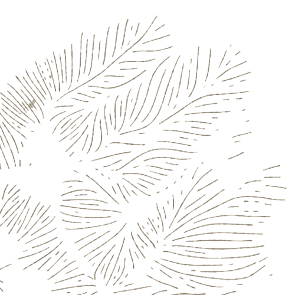

# Topo Hachures 4.1 for Blender



Topo Hachures is a bilingual Blender 5.x add-on that generates deterministic
cartographic hachures from a heightmap. The strokes follow the local terrain
aspect, while slope, elevation and directional exposure can control their
density.

The add-on is designed for large cartographic and graphic-design workflows. It
can export an editable SVG or a transparent PNG at the source resolution,
including maps around 20,000 pixels wide.

[Documentation française](README_FR.txt) · [English documentation](README_EN.txt)

[GitHub repository](https://github.com/Averrell/Hachure_topo_blender_generator) ·
[Latest release](https://github.com/Averrell/Hachure_topo_blender_generator/releases/latest)

## Main Features

- Deterministic hachures following the local downhill terrain direction.
- Slope-controlled spacing inspired by the original QGIS method.
- Optional continuous **Density by level** modulation:
  black produces fewer strokes, middle gray preserves the calculated density,
  and white produces more strokes.
- Independent directional-shadow pass with an eight-direction compass and
  adjustable azimuth and strength.
- Separate editable Inkscape layers in SVG exports:
  `Hachures — slope` and `Hachures — shadow`.
- SVG and transparent PNG output.
- Output dimensions matched automatically to the source heightmap, with an
  optional scale factor or custom dimensions.
- Up to three exclusion masks with a continuous decimal margin.
- Automatic detection of map boundaries and separate islands.
- Quick comparison preview using either a crop of the real heightmap or a
  deterministic synthetic relief.
- Multicore, strip-based PNG rendering to reduce memory usage.
- Reusable disk caches for terrain analysis, contours, geometry and optional
  final PNGs.
- Settings saved automatically and embedded in SVG metadata without personal
  file paths.
- French and English interface directly inside Blender.

## How It Works

Topo Hachures processes invisible contour levels from low to high. Candidate
stroke starts are distributed along contour segments, then traced according to
the local aspect field. Slope determines whether a stroke can exist and how
closely strokes are spaced.

Version 4.1 contains two independent geometry passes:

1. **Slope layer** — average slope controls spacing between the chosen minimum
   and maximum values.
2. **Shadow layer** — an exposure raster compares the local downhill direction
   with the chosen azimuth and adds extra, interleaved strokes only to matching
   faces.

Changing or disabling the shadow pass never redistributes the slope layer.
There is no random drawing, random deletion or per-mountain averaging: the same
heightmap and settings produce the same geometry.

## Requirements

- Blender **5.0 or later**.
- A heightmap image; a grayscale PNG is recommended.
- Enough free RAM and disk space for the selected output resolution.
- [Inkscape](https://inkscape.org/) is optional and is only needed for the
  convenient SVG-to-PNG conversion command.

No separate Python installation or `pip` command is required. The add-on uses
Blender's bundled Python and NumPy environment.

## Installation

1. Download `topo_hachures_4_1.zip` from the
   [Releases page](https://github.com/Averrell/Hachure_topo_blender_generator/releases).
2. Disable any older Topo Hachures version.
3. Restart Blender.
4. Open **Edit → Preferences → Add-ons**.
5. Click **Install from Disk**.
6. Select `topo_hachures_4_1.zip` without extracting it.
7. Enable **Topo Hachures 4.1 SVG / PNG**.
8. In the 3D View, press `N` and open the **Topo Hachures** tab.

## Quick Start

1. Select **Français** or **English** at the top of the panel.
2. Choose the heightmap in **Input / output**.
3. Choose `SVG` or `PNG` and select the output path.
4. Keep **Match image size** enabled to preserve the heightmap dimensions, or
   choose an output scale/custom size.
5. Adjust the contour interval, segment length, spacing, thickness and slope
   thresholds.
6. Use **Compare heightmap / hachures** to test the settings on a small crop.
7. Add exclusion masks if required.
8. Click **Export final render**.

For a large map, always begin with the preview and moderate spacing values.
Very dense hachures can create extremely large SVG files and long processing
times.

## Output Formats

### SVG

- Fully vectorial and editable.
- Keeps slope and directional-shadow hachures in separate Inkscape layers.
- Stores the generation settings in metadata, without input/output paths.
- Can be reopened directly or converted with the Inkscape command copied from
  the add-on panel.

### PNG

- Raster output ready for Photoshop or other image editors.
- Optional transparent background.
- Rendered in horizontal strips to limit RAM use.
- Can use all available logical CPU cores.
- Interrupted exports retain resumable strip data; completed cached PNGs can be
  restored immediately when the same parameters are used again.

## Density Controls

### Slope Density

- Below **Minimum slope**: no hachure.
- On retained gentle slopes: spacing approaches the selected maximum.
- On steep slopes: spacing approaches the selected minimum.
- **Slope influence** at 100% uses the complete variation; at 0%, all retained
  slopes use the maximum spacing.

### Density by Level

This optional modulation changes only the spacing already calculated:

- black: sparser hachures;
- middle gray: unchanged local density;
- white: denser hachures;
- intermediate values: continuous transitions.

At 50% strength, the approximate multipliers are `0.5× / 1× / 1.5×`.
Disabling the option or setting its strength to 0% reproduces the 4.0 geometry.

### Directional Shadow

- `0°` north;
- `90°` east;
- `180°` south;
- `270°` west.

At 100% strength, a perfectly aligned face can receive up to 100% additional
stroke starts relative to its local slope density. The effect decreases
continuously with angular difference and produces no addition at 90°, on the
opposite face or below the minimum-slope threshold.

## Masks and Boundaries

Up to three PNG masks can be merged:

- opaque white: exclude hachures;
- black or transparent: keep hachures.

Masks must use the same framing and proportions as the heightmap. **Mask
margin** supports decimal values such as `0.1`, `0.25` and `0.5` pixels.

**Exclude map boundaries** detects separate map shapes and islands, then pulls
the strokes away from their silhouettes.

## Important Settings

| Setting | Default | Purpose |
|---|---:|---|
| Contour interval | `12` | Vertical interval between invisible control contours |
| Contour segment length | `80 px` | Area used to measure average slope |
| Minimum spacing | `4 px` | Density on the steepest retained slopes |
| Maximum spacing | `12 px` | Density on gentle retained slopes |
| Slope influence | `100%` | Strength of slope-based spacing variation |
| Density by level | Off | Continuous height-value modulation |
| Level influence | `50%` | Strength of level-density modulation |
| Constant thickness | `1` | Stroke width for all hachures |
| Minimum slope | `20%` | Threshold below which no strokes are generated |
| Maximum-density slope | `75%` | Threshold where density reaches its maximum |
| Directional shadow | Off | Enables the independent exposure pass |
| Directional strength | `45%` | Number of additional exposed-face strokes |
| Target direction | `180°` | Direction used by the exposure pass |
| Maximum analysis resolution | `4096 px` | Limits terrain-analysis cost on huge heightmaps |
| Cores / workers | `0` | Automatic: use all available logical cores for PNG |
| PNG strip height | `256 px` | Memory/performance balance for raster export |

## Cache and Settings

The cache manager displays its total size and number of variants. Clearing the
cache requires confirmation. Version 4.1 reuses compatible analysis and contour
caches from earlier versions, while geometry affected by level density receives
a separate signature.

The add-on can:

- restore the last successful settings;
- restore settings embedded in a Topo Hachures SVG;
- open the output folder;
- open the latest SVG;
- copy a PowerShell command for Inkscape conversion.

## Repository Structure

```text
topo_hachures_4_1/
├── __init__.py       # Blender interface, cache manager and SVG/PNG export
├── th_worker.py      # Deterministic terrain analysis and hachure geometry
├── assets/logo.png   # Add-on logo
├── README.md         # GitHub documentation
├── README_EN.txt     # English offline documentation
├── README_FR.txt     # French offline documentation
└── README.txt        # Short bilingual installation note
```

Keep the `topo_hachures_4_1` folder as the top-level folder inside the release
ZIP so Blender can install it directly.

## Related Project

Topo Hachures was developed for the cartographic workflow used by the
[Arkhitecton Foxhole Map Exporter](https://github.com/Averrell/fh_map_exporter_arkhitecton),
but it can be used with any suitable heightmap.

## Credits and Method Reference

This is an independent Blender add-on, not an official fork of the QGIS
project. Its contour-driven hachuring method is based on Daniel Huffman's work:

- [Automated Hachuring in QGIS](https://somethingaboutmaps.wordpress.com/2024/07/07/automated-hachuring-in-qgis/)
- [pinakographos/Hachures](https://github.com/pinakographos/Hachures)

Development, visual direction and testing: **Henri / Arkhitecton**.

ChatGPT was used as a programming assistant to understand the reference method
and to help implement and debug the Blender adaptation under manual supervision
and testing. AI was **not** used for graphic design or image generation: all
visual assets, drawings and graphic choices were created manually.

## License

This project is distributed under the **GNU General Public License v3.0**, in
line with the original `pinakographos/Hachures` project. See `LICENSE`.
